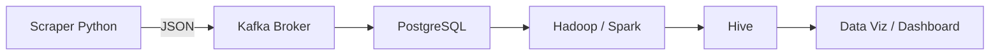

# Infra et orchestration de données MHFZ

> Ce projet met en place une architecture data temps réel + big data pour collecter (scraping), transporter (Kafka), stocker (PostgreSQL) et traiter à grande échelle (Hadoop/Spark) les données du jeu Monster Hunter Frontier Z, puis les exposer pour analyse et data visualisation.

## Sommaire
- [Objectif du projet](#objectif-du-projet)
- [Phase 1 : Pipeline minimal viable (MVP)](#phase-1--pipeline-minimal-viable-mvp)
- [Phase 2 : Pipeline Big Data étendu](#phase-2--pipeline-big-data-étendu)
- [Phase 3 : Supervision & Monitoring du Pipeline Data](#phase-3--supervision--monitoring-du-pipeline-data)
- [Architecture du projet](#Architecture-du-projet)

## Objectif du projet

Mettre en place une infrastructure de traitement de données en continu à l’aide de Kafka et PostgreSQL, afin d’automatiser la collecte, la transmission et le stockage des données issues du site Monster Hunter Frontier Z (MHFZ).

---

### Architecture globale (vue macro)



<details>
  <summary><h2>Phase 1 : Pipeline minimal viable (MVP)</h2></summary>

### Objectifs :
- Collecter un flux de données en continu.
- Le faire transiter via Kafka.
- Le consommer dans une application simple.
- Stocker de manière persistante dans PostgreSQL.

### 1. Scraper Python (Producteur Kafka)
- Scrape automatiquement les données d’armes depuis le site MHFZ (`scraper.py`).
- Transforme les informations collectées (nom, rareté, attaque, affinité, etc.) en objets JSON (`scraper.py`).
- Envoie ces messages dans un topic Kafka dédié (`run_scraper.py`).

### 2. Kafka Broker
- Sert d’intermédiaire entre le producteur et le consommateur.
- Gère la file de messages entrants et sortants.
- Stocke temporairement les messages envoyés par le producteur avant qu’ils ne soient lus par le consommateur.
- Évite toute perte de données en cas de surcharge ou de panne et régule le flux de traitement.

### 3. Consumer Kafka → PostgreSQL (Stockage persistant)
- Se connecte au broker Kafka.
- Écoute le topic `weapon_data`.
- Récupère les messages JSON et les insère dans PostgreSQL (une table par type d’arme).

### 4. Vérification de la persistance
```bash
# Contrôle du nombre d’enregistrements
SELECT COUNT(*) FROM long_sword;

# Vérification des contenus
SELECT name, rarity, attack, affinity FROM long_sword LIMIT 10;
```

### 5. Conteneurisation avec Docker Compose
- Déploiement simple et reproductible.
- Isolation des composants (Kafka, Scraper, PostgreSQL).
- Automatisation complète du pipeline.

### 6. Instructions pour lancer le stack Phase 1
```bash
git clone <repo_url>
cd <projet>
docker compose up --build

# Lancer Kafka
# Lancer le scraper Python (producteur)
# Démarrer PostgreSQL
# Connecter tous les services sur un réseau Docker interne
```
</details>

<details>
  <summary><h2>Phase 2 : Pipeline Big Data étendu</h2></summary>

### Objectifs :
- Extraire les données depuis PostgreSQL.
- Traiter à grande échelle via Hadoop MapReduce ou Spark.
- Stocker les résultats dans Hive.
- Automatiser l’infrastructure Big Data avec Ansible.

### 1. Extraction depuis PostgreSQL
```bash
# Tables extraites automatiquement
SELECT COUNT(*) FROM postgresdb;
SELECT * FROM postgresdb LIMIT 10;
```

### 2. Choix du moteur Hadoop
- Hadoop MapReduce : traitement batch distribué classique.
- Spark : traitement en mémoire plus rapide pour analyses interactives.

### 3. Traitement MapReduce
- Mapper : transforme chaque fichier JSON en paires clé-valeur pour analyse.
- Reducer : agrégation par type d’arme, rareté, attaque, affinité, etc.
- Objectif : calculer des statistiques massives et fréquences sur les armes.

### 4. Stockage des résultats dans Hive
- Accès rapide en lecture/écriture pour analyses futures.
- Gestion efficace des gros volumes de données structurées/semi-structurées.
- Historique complet des transformations.

### 5. Automatisation avec Ansible
- Déploiement du cluster Hadoop et Hive.
- Configuration des nodes et permissions.
- Déploiement automatisé des jobs ETL / MapReduce.
- Garantit fiabilité et reproductibilité.

### 6. Commandes d’exécution et de vérification Phase 2
```bash
# Extraction et contrôle PostgreSQL
psql -h <host> -U <user> -d <database>
SELECT COUNT(*) FROM postgresdb;
SELECT * FROM postgresdb LIMIT 10;

# Lancer un job Hadoop MapReduce
hdfs dfs -put weapon_data.json /input/
hadoop jar my_job.jar com.mhfz.analysis.WeaponStats /input /output

# Vérifier les résultats HDFS / Hive
hdfs dfs -ls /output/
hdfs dfs -cat /output/part-00000
hive
SELECT * FROM weapon_stats LIMIT 10;

# Automatisation Ansible
ansible-playbook -i inventory/deploy_hosts.yml deploy_hadoop_Hive.yml
```
</details>

<details>
  <summary><h2>Phase 3 : Supervision & Monitoring du Pipeline Data</h2></summary>

### Objectif global
Mettre en place un système complet de supervision pour l’ensemble du pipeline Data développé lors des Phases 1 et 2.  
L’objectif est de surveiller la **santé**, les **performances** et la **disponibilité** de tous les composants critiques :

- Kafka / KRaft (ingestion temps réel)  
- PostgreSQL, Hadoop, Spark (traitement & stockage intermédiaire)  
- Hive (stockage final Big Data)  
- Conteneurs, services et processus déployés  
- Ressources machines : CPU, RAM, disque, réseau  

La stack minimale attendue comprend :  
✔️ **Prometheus** pour la collecte de métriques  
✔️ **Grafana** pour la visualisation (dashboards & alerting)

---

### 1. Mise en place de Prometheus (collecte de métriques)
- Déployé via Docker ou service système selon l’environnement.
- Rôle : interroger régulièrement des endpoints d’exporters, stocker les métriques dans une base TSDB interne.
- Configuration principale (`prometheus.yml`) :
  - Scrape de Kafka / KRaft via *JMX Exporter*
  - Scrape de PostgreSQL via *postgres_exporter*
  - Scrape des services Hadoop / Spark via *Node Exporter* ou exporters dédiés
  - Scrape des conteneurs Docker via *cAdvisor*

```yaml
scrape_configs:
  - job_name: 'kafka'
    static_configs:
      - targets: ['kafka:7071']

  - job_name: 'postgres'
    static_configs:
      - targets: ['postgres_exporter:9187']

  - job_name: 'nodes'
    static_configs:
      - targets: ['node_exporter:9100']
```

---

### 2. Exporters à mettre en place

#### ✔ Kafka JMX Exporter
- Permet d’exposer les métriques internes du broker Kafka / KRaft :
  - taux de production & consommation
  - lag des partitions
  - cycles GC, heap JVM, threads

#### ✔ PostgreSQL Exporter
- Expose les métriques :
  - connexions actives
  - throughput en lecture/écriture
  - temps de requêtes
  - taille des tables

#### ✔ Node Exporter
- Expose les métriques system-level :
  - CPU, RAM, DISK, IO, réseau
  - parfait pour superviser les nodes Hadoop / Spark

#### ✔ cAdvisor (optionnel mais recommandé)
- Supervision des conteneurs Docker :
  - CPU / mémoire / IO par container
  - consommation réseau
  - processus internes

---

### 3. Mise en place de Grafana (visualisation)
Grafana se connecte à Prometheus via une datasource unique.

Dashboards recommandés :
- **Kafka Overview** (production, consommation, lag par consumer group)
- **PostgreSQL Performance** (latence, locks, utilisation mémoire)
- **Hadoop/Spark Cluster Health** (CPU des nœuds, tâches en cours, erreurs)
- **Hive** (requêtes, temps de scan, saturation de régions)
- **Infrastructure Dashboard** (CPU, RAM, disque, réseau)

Commande de déploiement (Docker) :
```bash
docker run -d -p 3000:3000 grafana/grafana
```

Accès :
- URL : http://localhost:3000  
- identifiants par défaut : **admin / admin**

---

### 4. Mise en place d’un monitoring d’infrastructure
Les métriques exposées par Node Exporter permettent de surveiller :

- CPU (user, system, load average)
- RAM (free, used, buffers/cache)
- Inodes & disque
- Bande passante réseau & saturation NIC
- Processus en exécution

Exemple d’alertes Prometheus recommandées :
```yaml
groups:
- name: infra-alerts
  rules:
    - alert: HighCPUUsage
      expr: avg(rate(node_cpu_seconds_total{mode="idle"}[5m])) < 0.20
      for: 2m
      labels:
        severity: warning
      annotations:
        description: "CPU au-dessus de 80% depuis plus de 2 minutes"
```

---

### 5. Dashboards indispensables

#### Dashboard 1 → *Kafka Monitoring*
Doit inclure :
- taux de production / consommation
- lag par topic
- nombre de partitions offline
- métriques JVM du broker

#### Dashboard 2 → *PostgreSQL / Hadoop / Spark*
- temps de requêtes PostgreSQL
- tasks Spark exécutées / échouées
- occupation HDFS / saturation datanodes

#### Dashboard 3 → *Infrastructure globale*
- CPU / RAM / DISK / réseau des machines
- surveillance des conteneurs via cAdvisor

---

### 6. Commandes d’exécution & tests
```bash
# Vérifier que les endpoints répondent
curl http://localhost:9090/metrics       # Prometheus
curl http://localhost:9100/metrics       # Node Exporter
curl http://localhost:9187/metrics       # PostgreSQL Exporter

# Accès Grafana
http://localhost:3000
```

---

</details>

## Architecture du projet

```markdowmn
INFRA-ET-ORCH
[Répertoire Racine]
├── .vscode/
│   └── settings.json
├── Ruché/
│   └── docker-compose.yml (Application-specific)
├── ansible/
│   ├── inventory.ini
│   └── playbook.yml
├── consommateur/
│   ├── Dockerfile
│   ├── consumer_postgres.py
│   └── requirements.txt
├── Kafka/
│   ├── Dockerfile
│   └── start-kraft.sh
├── grattoir/
│   ├── Dockerfile
│   ├── requirements.txt
│   ├── run_scraper.py
│   └── scraper.py
├── venv/
│   ├── Lib/site-packages/
│   │   └── pip-25.0.1.dist-info/
│   │       ├── AUTHORS.txt
│   │       ├── INSTALLER
│   │       ├── LICENSE.txt
│   │       ├── METADATA
│   │       ├── RECORD
│   │       ├── REQUESTED
│   │       ├── WHEEL
│   │       ├── entry_points.txt
│   │       └── top_level.txt
│   ├── pip/ (Dossier du venv)
│   └── Scripts/ (Dossier du venv)
├── Hadoop/
│   ├── data/
│   │   └── last_export.txt
│   ├── python-container/
│   │   ├── Dockerfile
│   │   ├── crontab
│   │   ├── export_postgres.py
│   │   ├── hadoop-env.sh
│   │   ├── insert_to_hive.py
│   │   ├── mapper.py
│   │   ├── reducer.py
│   │   ├── requirements.txt
│   │   ├── run_hadoop_pipeline.py
│   │   └── run_hadoop_pipeline.sh
│   └── docker-compose.yml
├── pyvenv.cfg
├── .gitignore
├── README.md
├── docker-compose.yml (Main project level)
└── image.png

```
