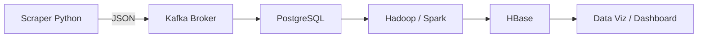

# Infra et orchestration de données MHFZ

> Ce projet met en place une architecture data temps réel + big data pour collecter (scraping), transporter (Kafka), stocker (PostgreSQL) et traiter à grande échelle (Hadoop/Spark) les données du jeu Monster Hunter Frontier Z, puis les exposer pour analyse et data visualisation.

## Sommaire
- [Objectif du projet](#objectif-du-projet)
- [Phase 1 : Pipeline minimal viable (MVP)](#phase-1--pipeline-minimal-viable-mvp)
- [Phase 2 : Pipeline Big Data étendu](#phase-2--pipeline-big-data-étendu)

## Objectif du projet

Mettre en place une infrastructure de traitement de données en continu à l’aide de Kafka et PostgreSQL, afin d’automatiser la collecte, la transmission et le stockage des données issues du site Monster Hunter Frontier Z (MHFZ).

---

### Architecture globale (vue macro)



<details>
  <summary><h2>Phase 1 : Pipeline minimal viable (MVP)</h2></summary>

### Objectifs :
- Collecter un flux de données en continu.
- Le faire transiter via Kafka.
- Le consommer dans une application simple.
- Stocker de manière persistante dans PostgreSQL.

### 1. Scraper Python (Producteur Kafka)
- Scrape automatiquement les données d’armes depuis le site MHFZ (`scraper.py`).
- Transforme les informations collectées (nom, rareté, attaque, affinité, etc.) en objets JSON (`scraper.py`).
- Envoie ces messages dans un topic Kafka dédié (`run_scraper.py`).

### 2. Kafka Broker
- Sert d’intermédiaire entre le producteur et le consommateur.
- Gère la file de messages entrants et sortants.
- Stocke temporairement les messages envoyés par le producteur avant qu’ils ne soient lus par le consommateur.
- Évite toute perte de données en cas de surcharge ou de panne et régule le flux de traitement.

### 3. Consumer Kafka → PostgreSQL (Stockage persistant)
- Se connecte au broker Kafka.
- Écoute le topic `weapon_data`.
- Récupère les messages JSON et les insère dans PostgreSQL (une table par type d’arme).

### 4. Vérification de la persistance
```bash
# Contrôle du nombre d’enregistrements
SELECT COUNT(*) FROM long_sword;

# Vérification des contenus
SELECT name, rarity, attack, affinity FROM long_sword LIMIT 10;
```

### 5. Conteneurisation avec Docker Compose
- Déploiement simple et reproductible.
- Isolation des composants (Kafka, Scraper, PostgreSQL).
- Automatisation complète du pipeline.

### 6. Instructions pour lancer le stack Phase 1
```bash
git clone <repo_url>
cd <projet>
docker compose up --build

# Lancer Kafka
# Lancer le scraper Python (producteur)
# Démarrer PostgreSQL
# Connecter tous les services sur un réseau Docker interne
```
</details>

<details>
  <summary><h2>Phase 2 : Pipeline Big Data étendu</h2></summary>

### Objectifs :
- Extraire les données depuis PostgreSQL.
- Traiter à grande échelle via Hadoop MapReduce ou Spark.
- Stocker les résultats dans HBase.
- Automatiser l’infrastructure Big Data avec Ansible.

### 1. Extraction depuis PostgreSQL
```bash
# Tables extraites automatiquement
SELECT COUNT(*) FROM postgresdb;
SELECT * FROM postgresdb LIMIT 10;
```

### 2. Choix du moteur Hadoop
- Hadoop MapReduce : traitement batch distribué classique.
- Spark : traitement en mémoire plus rapide pour analyses interactives.

### 3. Traitement MapReduce
- Mapper : transforme chaque fichier JSON en paires clé-valeur pour analyse.
- Reducer : agrégation par type d’arme, rareté, attaque, affinité, etc.
- Objectif : calculer des statistiques massives et fréquences sur les armes.

### 4. Stockage des résultats dans HBase
- Accès rapide en lecture/écriture pour analyses futures.
- Gestion efficace des gros volumes de données structurées/semi-structurées.
- Historique complet des transformations.

### 5. Automatisation avec Ansible
- Déploiement du cluster Hadoop et HBase.
- Configuration des nodes et permissions.
- Déploiement automatisé des jobs ETL / MapReduce.
- Garantit fiabilité et reproductibilité.

### 6. Commandes d’exécution et de vérification Phase 2
```bash
# Extraction et contrôle PostgreSQL
psql -h <host> -U <user> -d <database>
SELECT COUNT(*) FROM postgresdb;
SELECT * FROM postgresdb LIMIT 10;

# Lancer un job Hadoop MapReduce
hdfs dfs -put weapon_data.json /input/
hadoop jar my_job.jar com.mhfz.analysis.WeaponStats /input /output

# Vérifier les résultats HDFS / HBase
hdfs dfs -ls /output/
hdfs dfs -cat /output/part-00000
hbase shell
scan 'weapon_stats'

# Automatisation Ansible
ansible-playbook -i inventory/deploy_hosts.yml deploy_hadoop_hbase.yml
```
</details>
